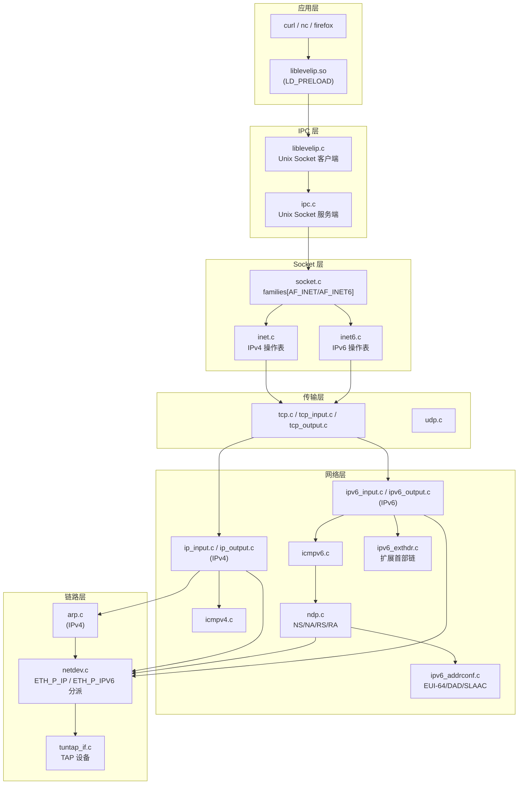
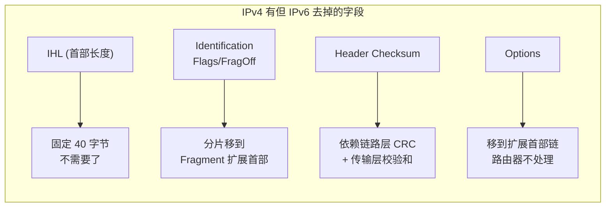
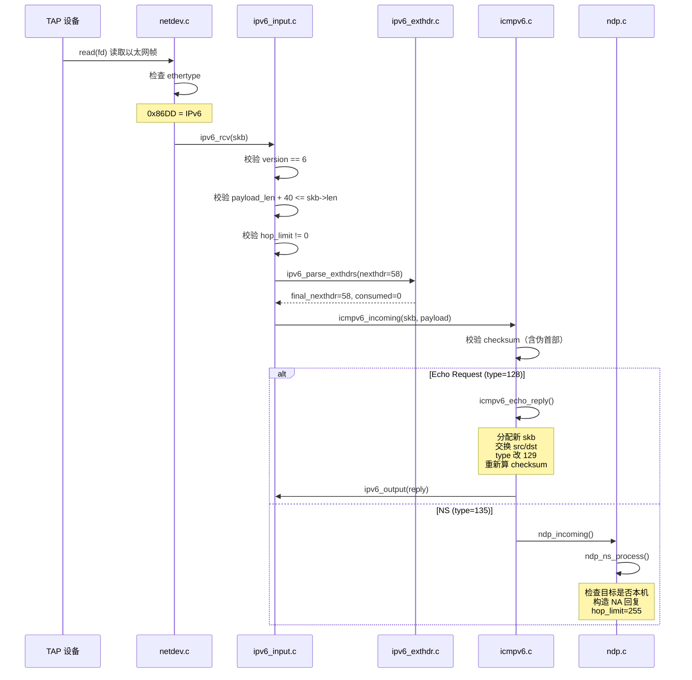
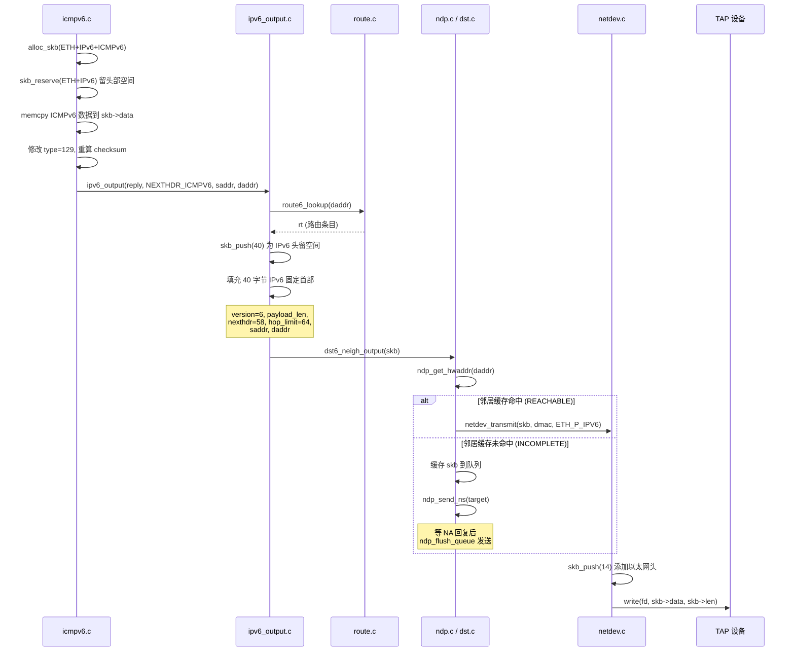
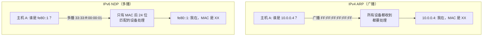
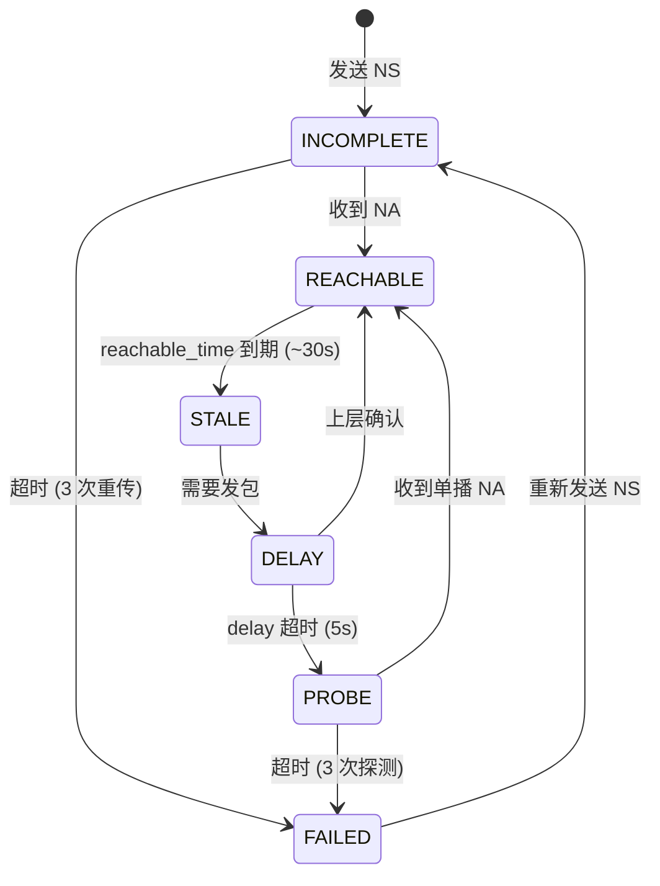
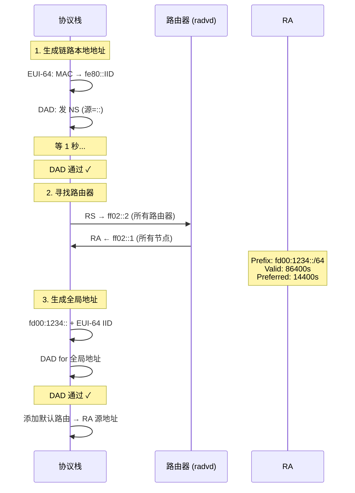
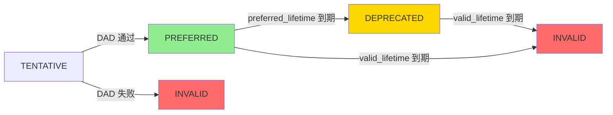
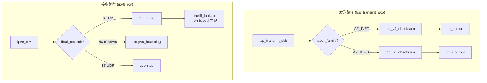
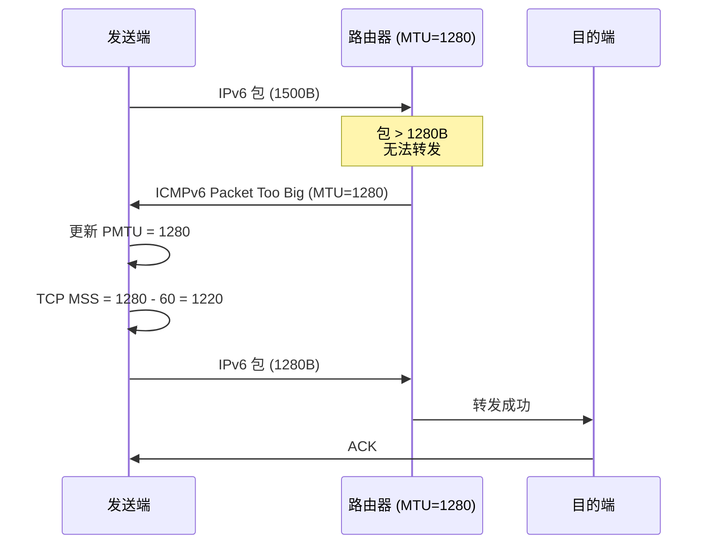

# IPv6 协议栈学习笔记

> 基于 level-ip 用户态协议栈的 IPv6 实现学习记录
> 日期：2026-07-04

---

## 1. 项目全景：模块架构



**关键设计**：`netdev.c` 是收包分派点——根据以太网帧的 EtherType 决定交给 IPv4 还是 IPv6 处理：
- `0x0800` (ETH_P_IP) → `ip_rcv()`
- `0x86DD` (ETH_P_IPV6) → `ipv6_rcv()`

---

## 2. IPv4 vs IPv6 首部深度对比

### 2.1 首部结构

```
IPv4 首部 (20-60 bytes, 可变):
┌─────────┬─────────┬─────────┬───────────┬──────────────┐
│Version  │IHL      │DSCP/ECN │Total Len  │              │
│ (4 bit) │ (4 bit) │ (8 bit) │ (16 bit)  │              │
├─────────┴────┬────┴─────────┼───────────┼──────────────┤
│Identification│Flags+FragOff │   TTL     │   Protocol   │
│  (16 bit)    │  (16 bit)    │  (8 bit)  │   (8 bit)    │
├──────────────┴──────────────┼───────────┴──────────────┤
│       Header Checksum       │                          │
│         (16 bit)            │                          │
├─────────────────────────────┴──────────────────────────┤
│              Source Address (32 bit)                    │
├────────────────────────────────────────────────────────┤
│            Destination Address (32 bit)                 │
├────────────────────────────────────────────────────────┤
│              Options (0-40 bytes, 可选)                  │
└────────────────────────────────────────────────────────┘

IPv6 首部 (40 bytes, 固定):
┌─────────┬──────────────┬───────────────────────────┐
│Version  │Traffic Class │       Flow Label          │
│ (4 bit) │  (8 bit)     │       (20 bit)            │
├─────────┴──────────────┼─────────────┬─────────────┤
│    Payload Length      │Next Header  │  Hop Limit  │
│      (16 bit)          │  (8 bit)    │   (8 bit)   │
├────────────────────────┴─────────────┴─────────────┤
│                                                    │
│           Source Address (128 bit)                 │
│                                                    │
├────────────────────────────────────────────────────┤
│                                                    │
│         Destination Address (128 bit)              │
│                                                    │
└────────────────────────────────────────────────────┘
```

### 2.2 IPv6 去掉了什么？为什么？



| 去掉的字段 | 原因 | 影响 |
|-----------|------|------|
| **首部校验和** | 每跳 TTL 变化都要重算，浪费 CPU。链路层有 CRC-32，传输层有 TCP/UDP 校验和，IP 层再算是三重冗余 | 路由器处理速度提升 |
| **分片字段** | 路由器分片增加复杂度，重组可能在错误的地方发生。IPv6 用 PMTUD 让发送端自己找到合适的包大小 | 路由器不分片，只管转发 |
| **Options** | 所有中间设备都要解析 Options，即使不关心。IPv6 用扩展首部链，路由器只看 Hop-by-Hop | 路由器处理更快 |

### 2.3 IPv6 新增了什么？

**Flow Label（20 bits）**：标识一个"流"，让路由器快速做 QoS 决策。

```
IPv4 做 QoS：解析五元组（源IP + 目的IP + 源端口 + 目的端口 + 协议）→ 慢
IPv6 做 QoS：只看 Flow Label（20 bits）→ 快
```

---

## 3. 收包路径：从 TAP 到 ICMPv6



### 3.1 关键代码路径

```c
// netdev.c: 收包分派
switch (hdr->ethertype) {
    case ETH_P_IP:   ip_rcv(skb);   break;  // IPv4
    case ETH_P_IPV6: ipv6_rcv(skb); break;  // IPv6
}

// ipv6_input.c: 扩展首部链遍历
ret = ipv6_parse_exthdrs(skb, ip6h->nexthdr,
                         (uint8_t *)(ip6h + 1), plen, &ext_result);

// 按 final_nexthdr 分派
switch (ext_result.final_nexthdr) {
    case NEXTHDR_ICMPV6: icmpv6_incoming(skb, payload); break;
    case NEXTHDR_TCP:    tcp_in_v6(skb, payload);       break;
    case NEXTHDR_UDP:    udp_in_v6_stub(skb);            break;
}
```

---

## 4. 发包路径：从 ICMPv6 Reply 到 TAP



### 4.1 skb 空间管理（最容易出 bug 的地方）

```
alloc_skb(86) 后的 skb 布局:
  head ──→ [          86 字节缓冲区          ] ←── end
  data ──→ ↑
  len = 0

skb_reserve(54) 后（预留 ETH 14 + IPv6 40 的 headroom）:
  head ──→ [ 54 字节 headroom |  32 字节空间  ] ←── end
  data ──→                  ↑
  len = 0

memcpy + len=32 后（写入 ICMPv6 数据）:
  head ──→ [ 54 字节 headroom | ICMPv6 32B    ] ←── end
  data ──→                  ↑
  len = 32

skb_push(40) 后（ipv6_output 添加 IPv6 头）:
  head ──→ [14B| IPv6 40B | ICMPv6 32B        ] ←── end
  data ──→  ↑
  len = 72

netdev_transmit: skb_push(14) 后（添加以太网头）:
  head ──→ [ETH 14B| IPv6 40B | ICMPv6 32B    ] ←── end
  data ──→ ↑
  len = 86 → write(fd) 写入 TAP
```

**教训**：绝对不能用 `skb_push` 写入数据载荷！`skb_push` 是向前扩展（消耗 headroom），用于添加协议头。写数据载荷用 `memcpy(skb->data, ...)` + 手动设 `skb->len`。

---

## 5. NDP 邻居发现协议

### 5.1 ARP vs NDP 对比



### 5.2 Solicited-Node 多播地址计算

```
IPv6 单播地址: 2001:db8::1234:5678
                 取最后 24 位: ──────^^^^^^
                              34:5678

拼到 ff02::1:ff 后面:
  ff02::1:ff34:5678

对应 MAC 多播地址:
  33:33:ff:34:56:78

一个 /64 子网最多 2^24 ≈ 1600 万个地址共享同一个 solicited-node
实际上一个链路上只有几十个设备 → 几乎就是单播的精度
```

### 5.3 邻居状态机（实测验证）



**实测观察**（用 `watch -n 1 'ip -6 neigh show dev tap0'`）：
```
ping6 前: (无条目)
ping6 时: REACHABLE lladdr 00:0c:29:6d:50:25
30 秒后:  STALE
再发包:   DELAY → PROBE → REACHABLE
5 分钟:   FAILED（不再主动探测）
```

---

## 6. SLAAC 地址自动配置

### 6.1 完整流程



### 6.2 EUI-64 接口标识符生成

```
MAC 地址 (6 字节): aa:bb:cc:dd:ee:ff

步骤 1: 中间切一刀
  aa:bb:cc | dd:ee:ff

步骤 2: 插入 FF:FE
  aa:bb:cc:FF:FE:dd:ee:ff  (8 字节)

步骤 3: 翻转第 7 位 (U/L bit)
  aa = 1010 1010
         ↑ 第 7 位
  翻转 → 1010 1000 = a8

结果: a8:bb:cc:ff:fe:dd:ee:ff

完整地址: fe80::a8bb:ccff:fedd:eeff
```

**为什么翻转第 7 位？** IEEE 规定 MAC 地址第 7 位 = 0 表示"全球唯一（厂商分配）"。翻转后变成 1，让 EUI-64 标识符的格式与"本地管理"地址区分开。这是一个历史遗留的设计约定。

### 6.3 地址生命周期



- **PREFERRED**：正常使用，新连接可以用这个地址
- **DEPRECATED**：旧连接继续用，但新连接不应该用它（即将过期）
- **INVALID**：地址失效，删除

---

## 7. ICMPv6 校验和：伪首部详解

### 7.1 为什么 ICMPv6 需要伪首部？

```
IPv4 ICMPv4: 校验和只覆盖 ICMP 报文本身
  → IPv4 首部有自己的校验和，保证地址正确

IPv6 ICMPv6: 校验和覆盖 伪首部 + ICMPv6 报文
  → IPv6 首部没有校验和！
  → 如果不用伪首部，攻击者可以篡改源/目的地址而不被发现
  → RFC 8200 §8.1 强制要求
```

### 7.2 伪首部结构

```
IPv6 伪首部 (40 bytes):
┌──────────────────────────────────────┐
│       Source Address (128 bit)       │  16 bytes
├──────────────────────────────────────┤
│     Destination Address (128 bit)    │  16 bytes
├──────────────────────────────────────┤
│     Upper-Layer Length (32 bit)      │   4 bytes
├──────────────────────────────┬───────┤
│       Zero (24 bit)          │NH (8) │   4 bytes
└──────────────────────────────┴───────┘
                                    ↑
                            ICMPv6 = 58
                            TCP    = 6
                            UDP    = 17
```

### 7.3 实现中的坑（真实 bug 记录）

**Bug 1：伪首部缓冲区偏移错误**

```c
// ❌ 错误：把长度和 NH 放在了偏移 20（混淆了 IPv4 伪首部 12 字节的布局）
pseudo[20] = len >> 8;    // 应该是 34！
pseudo[21] = len & 0xFF;  // 应该是 35！
pseudo[27] = NEXTHDR_ICMPV6;  // 应该是 39！

// ✅ 正确：IPv6 伪首部地址占 32 字节（16+16），长度从偏移 32 开始
pseudo[32] = len >> 24;
pseudo[33] = len >> 16;
pseudo[34] = len >> 8;
pseudo[35] = len & 0xFF;
pseudo[39] = NEXTHDR_ICMPV6;
```

**现象**：所有 ICMPv6 包校验和错误，内核静默丢弃。ping6 100% 丢包但没有崩溃。

**排查过程**：
```
1. tcpdump 看到 NA 包出去了           → 发送路径没问题
2. ip -6 neigh 显示 FAILED            → 内核没接受 NA
3. grep 日志发现 "checksum mismatch"  → 校验和算错了
4. 逐字节检查伪首部缓冲区              → 偏移 20 vs 32
```

**Bug 2：skb headroom 溢出**

```c
// ❌ 错误：skb_push 消耗了预留给 ETH+IPv6 头的 headroom
skb_reserve(reply, ETH_HDR_LEN + IPV6_HDR_LEN);  // headroom = 54
memcpy(skb_push(reply, icmpv6_len), icmph, icmpv6_len);  // headroom = 54-64 = -10！

// ✅ 正确：用 memcpy 写数据，不消耗 headroom
skb_reserve(reply, ETH_HDR_LEN + IPV6_HDR_LEN);  // headroom = 54
memcpy(reply->data, icmph, icmpv6_len);  // 写数据到 data 位置
reply->len = icmpv6_len;  // 手动设长度
```

**现象**：`munmap_chunk(): invalid pointer` 崩溃。后续 `skb_push(40)` 和 `skb_push(14)` 写入了已释放的内存。

**Bug 3：ipv6hdr 位域字节序**

```c
// ❌ 错误：小端系统上位域分配从 LSB 开始
struct ipv6hdr {
    uint32_t version:4,        // GCC 放在 bits 0-3
             traffic_class:8,  // bits 4-11
             flow_label:20;    // bits 12-31
};
// 实际数据 byte[0] = 0x60 → version(6) 在高 4 位 → 读到 0！

// ✅ 正确：不用位域，用 uint32_t + 位移函数
struct ipv6hdr {
    uint32_t vtc_flow;  // 原始 32 位
    ...
};
static inline uint8_t ipv6_hdr_version(const struct ipv6hdr *h) {
    return (uint8_t)(ntohl(h->vtc_flow) >> 28);
}
```

---

## 8. TCP over IPv6 双栈适配

### 8.1 struct sock 联合体改造

```c
// 改造前（仅 IPv4）:
struct sock {
    uint32_t saddr;  // IPv4 地址
    uint32_t daddr;
};

// 改造后（双栈）:
struct sock {
    uint8_t addr_family;  // AF_INET or AF_INET6
    uint8_t _pad;
    union {
        uint32_t v4;
        struct in6_addr v6;
    } saddr;
    union {
        uint32_t v4;
        struct in6_addr v6;
    } daddr;
};
```

**影响范围**：所有 `sk->saddr` 改为 `sk->saddr.v4`，涉及 tcp.c、tcp_output.c、inet.c、socket.c、icmpv4.c 等十几个文件。

### 8.2 收发路径分派



---

## 9. 扩展首部链

### 9.1 链式结构

```
IPv6 固定首部 (40B)
  Next Header = 0 (Hop-by-Hop)
      ↓
┌─────────────────────┐
│ Hop-by-Hop Options  │ Next Header = 44 (Fragment)
│ (可变长，8B 对齐)   │
└─────────────────────┘
      ↓
┌─────────────────────┐
│ Fragment Header     │ Next Header = 6 (TCP)
│ (固定 8B)           │
└─────────────────────┘
      ↓
┌─────────────────────┐
│ TCP Header          │
│ ...                 │
└─────────────────────┘
```

### 9.2 遍历算法

```c
int ipv6_parse_exthdrs(skb, nexthdr, start, plen, result)
{
    ptr = start;
    consumed = 0;

    while (iterations < 8) {  // 最多 8 层，防恶意循环
        switch (nexthdr) {
        case NEXTHDR_TCP:
        case NEXTHDR_UDP:
        case NEXTHDR_ICMPV6:
            // 到达上层协议，停止
            result->final_nexthdr = nexthdr;
            result->consumed = consumed;
            return 0;

        case NEXTHDR_HOP:
        case NEXTHDR_ROUTING:
        case NEXTHDR_DEST:
            // TLV 格式：nexthdr(1) + hdrlen(1) + data[]
            optlen = (opt->hdrlen + 1) * 8;
            nexthdr = opt->nexthdr;
            ptr += optlen;
            consumed += optlen;
            break;

        case NEXTHDR_FRAGMENT:
            // 固定 8 字节
            nexthdr = frag->nexthdr;
            ptr += 8;
            consumed += 8;
            break;
        }
    }
}
```

**关键设计**：路由器只处理 Hop-by-Hop Options（必须紧跟固定首部），其余扩展首部全部跳过。这就是 IPv6 路由器比 IPv4 快的原因之一。

---

## 10. PMTUD 路径 MTU 发现

### 10.1 流程



### 10.2 MSS 计算

```
IPv4: MSS = MTU - 20(IPv4 头) - 20(TCP 头) = MTU - 40
IPv6: MSS = PMTU - 40(IPv6 头) - 20(TCP 头) = PMTU - 60

MTU=1500: IPv4 MSS=1460, IPv6 MSS=1440
MTU=1280: IPv4 MSS=1240, IPv6 MSS=1220
```

---

## 11. 调试实战技巧

### 11.1 常用命令

```bash
# 抓 ICMPv6 全部报文
sudo tcpdump -i tap0 -n -vv icmp6

# 只看 NDP 报文
sudo tcpdump -i tap0 -n 'icmp6 and (ip6[40]==133 or ip6[40]==134 or ip6[40]==135 or ip6[40]==136)'

# 验证校验和
sudo tcpdump -i tap0 -n -vv icmp6 2>&1 | grep -i "checksum\|bad\|incorrect"

# 邻居缓存实时观察
watch -n 1 'ip -6 neigh show dev tap0'

# GDB 调试
sudo -E gdb ./lvl-ip
(gdb) break netdev_transmit
(gdb) break icmpv6_incoming
(gdb) break ndp_ns_process
(gdb) run
```

### 11.2 排查清单

```
ping6 不通时按顺序检查：

1. 协议栈收到 Echo Request 了吗？
   → grep "icmpv6 in" /tmp/lvl-ip.log
   → 如果没有：收包路径有 bug

2. checksum 通过了吗？
   → grep "checksum mismatch" /tmp/lvl-ip.log
   → 如果有：校验和计算有 bug

3. Reply 发出去了吗？
   → grep "ipv6 out" /tmp/lvl-ip.log
   → 如果有但 tcpdump 看不到：skb 构造有 bug

4. 路由查找成功了吗？
   → grep "route lookup failed" /tmp/lvl-ip.log
   → 如果失败：检查 route6_add 是否添加了 fe80::/10

5. NDP 通了吗？
   → tcpdump 看有没有 NS/NA 交互
   → 如果 NA 发出去但 host 不认：NA 的 checksum 或 flags 有问题

6. tun_write 成功了吗？
   → GDB break netdev_transmit，检查 ret 值
   → ret > 0 表示写入成功
```

---

## 12. 已实现功能清单

| 功能 | RFC | 文件 | 状态 |
|------|-----|------|------|
| IPv6 首部解析/构造 | RFC 8200 | ipv6.h, ipv6_input.c, ipv6_output.c | ✅ 已验证 |
| 扩展首部链遍历 | RFC 8200 §4 | ipv6_exthdr.c | ✅ 编译通过 |
| ICMPv6 Echo | RFC 4443 | icmpv6.c | ✅ ping6 通 |
| ICMPv6 差错报文 | RFC 4443 §3 | icmpv6.c | ✅ 编译通过 |
| NDP NS/NA | RFC 4861 | ndp.c | ✅ 邻居缓存建立 |
| NDP RS/RA | RFC 4861 | ndp.c | ✅ RS 发出，RA 解析 |
| SLAAC | RFC 4862 | ipv6_addrconf.c | ✅ 编译通过 |
| DAD | RFC 4862 §5 | ipv6_addrconf.c | ✅ NS 发出 |
| EUI-64 地址生成 | RFC 4291 | ipv6_addrconf.c | ✅ 地址正确 |
| TCP over IPv6 | RFC 8200 §8.1 | tcp.c, inet6.c | ✅ 编译通过 |
| PMTUD | RFC 8201 | icmpv6.c, route.c | ✅ 编译通过 |
| 双栈 socket | — | sock.h, socket.c | ✅ IPv4 回归通过 |
| IPC 扩展 | — | ipc.h, ipc.c, liblevelip.c | ✅ 编译通过 |
